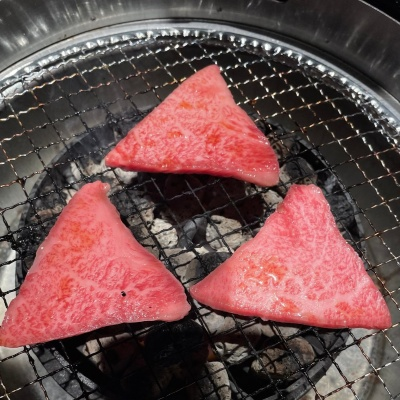

# 企画・編集

    
    

        

            <b>親方 </b>
            <a href="https://twitter.com/oyakata2438">X@otakata2438</a>
        

        

            サークル名：親方Project
        

    

ワンストップ本シリーズ企画・編集（一部執筆）してます。コミケと技術書典に出没。ついに技術書同人誌博覧会（技書博）のコアスタッフとして運営側に参加。技術書イベントが増えて嬉しいけれど、イベント多すぎて外出チケットと徳が不足気味。徳を貯めるべく、家事をこなしつつ、ラボに遊びに行ったり、飲み会や懇親会で著者を新規開拓したり。著者募集はいつでもやっていますので、ぜひご参加ください。

# 著者紹介

    
    

        

            <b>erukiti（えるきち）</b>
            <a href="https://twitter.com/erukiti">X@erukiti</a>
        

        

            サークル名：東京ラビットハウス
            <a href="https://rabbit-house.tokyo">https://rabbit-house.tokyo</a>
        

    

2023 年春にフロントエンドエンジニアからAI エンジニアに転向しました。好きなものとそうじゃないもので濃淡が激しすぎると評判（？）です。自分のサークルではここ数年出せてませんでした。久々の本を書いてどきどきです。

    
    

        

            <b>もっと</b>
            <a href="https://twitter.com/mottox2">X@mottox2</a>
        

        

          <a href="https://twitter.com/mottox2">https://mottox2.com</a>
        

    

ソフトウェアデザイナーです。かねてから気になっていたVivliostyleで本を作る機会に恵まれました。原稿は程々にテーマファイルをひたすら弄っていました。

    
    

        

            <b>yumechi</b>
            <a href="https://twitter.com/__yumechi">X@__yumechi</a>
        

    

GitHub Copilot にサジェストさせようとしたら yumechi はぬか漬けを作るツールだと説明されました。焼肉と漬物が大好きで、焼肉を食べるためだけに同人誌を書くことがあります。

    
    

        

            <b>FORTE(フォルテ)</b>
            <a href="https://x.com/FORTEgp05">Twitter(X)@FORTEgp05</a>
        

        

            サークル名：aozora Project
            <a href="https://techbookfest.org/organization/30860006">技術書典サークルページ</a>
        

    

Webアプリケーションのバックエンドエンジニアですが、いろいろやってます。Twitter、ブログ、Podcast配信、数多くの趣味と楽しく活動中。

    
    

        

            <b>おかもとゆうすけ</b>
            <a href="https://x.com/yuusukesan18">Twitter(X)@yuusukesan18</a>
        

        

            サークル名：はーふテックサークル
            <a href="https://techbookfest.org/organization/7pj05qVaGLL0f2HHhJGZzk">技術書典サークルページ</a>
        

    

都内でソフトウェアエンジニアとして働いています。主戦場は、Go言語。

    
    

        

            <b>湊川（みなとがわ）あい</b>
            <a href="https://x.com/llminatoll/">Twitter(X)@llminatoll</a>
        

        

            サークル名：湊川あいの、わかば家。
            <a href="https://llminatoll.booth.pm/">pixiv BOOTH</a>
        

    

解説漫画家。表紙イラストと、「材料3つ、5分でつくるラスク」「鮭の柚子胡椒ホイル蒸し」のレシピを担当しました。2023年に我が子をデプロイし、しばらく運用（育児）にかかりきりでした。最近やっと手が離れてきましたので、やっていくぞ〜という気持ちです。久々に「ワンストップくんちゃん」を描けて楽しかったです。表紙の料理がおいしそうに見えているといいのですが。

    
    

        

            <b>ぽにょ</b>
            <a href="https://x.com/ponyoxa/">Twitter(X)@ponyoxa</a>
        

        

            サークル名：EverTail Lab
            <a href="https://ponyoxa.com/circle">ponyoxa ホームページ</a>
        

    

主にバックエンドエンジニア。キーボードが好き。

<!-- ページ数調整 -->
 
 
 
 
 
 
 
 
 
 
