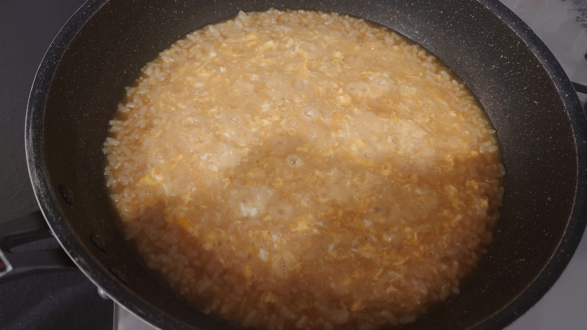

# 突然鍋奉行が降ってきても安心！　雑炊再入門

家人が病気にかかって雑炊が作りたくなった時や、急に鍋奉行が降ってきて困ったことはありませんか？

本章では、そんな時に役立つ、雑炊の手順を学んでいきましょう。

## 前提として

まず、可能ならなるべく鍋をします。

鍋の後の出汁を再利用するのが雑炊における鉄板です。アクをしっかり取っておく事が美味しい雑炊に繋がります。美味しい雑炊を食べたければ徹底的にアクと戦いましょう。

そして、次にあげる雑炊に必要な具材を準備しましょう。

| 具材 | 必要度 | 必要量 | 備考 |
| ---- | ---- | ---- | ---- |
| ごはん | ★★★ | 鍋に突っ込んで7～8割ぐらいの量までにする | これがないと始まらない！ |
| 味の素 | ★★ | 適量 | うまい雑炊を作りたければ必須 |
| しお | ★★★ | 適量 | ごはんと塩だけあれば一応なんとかはなります。あじしおでも可(あじしおの方が楽) |
| 醤油 | ★★ | 適量 | 醤油味にしたい人はマスト |
| 卵 | ★★ | ご飯の茶碗の杯数ｘ1～1.5個ぐらいまで | 卵雑炊にしたい人は準備しておきましょう。多くても実は何とかなる |
| カットねぎ | ★ | 適量 | 薬味が必要であれば準備しましょう |
| きざみのり | ★ | 適量 | 薬味が必要であれば準備しましょう |

## 手順

雑炊は次の手順で作ります。

### 鍋のつゆをこす

具材は雑味なので限界まで濾して、液体のみになっているのが望ましいです。アク取り用のおたま(アク取りさんhttps://terna.official.ec/items/68429717/など)を使ってこしてもよいし、網杓子(網になっているおたま)などを使ってもよいでしょう。

### 鍋を沸かす

まずは鍋を沸かしましょう。更にこの時に、雑炊の味を決めるため味を調整します。

手順としては

 * 味の素を入れて、出汁の味がわかるところまでもっていく（※味の素はいくら入れすぎても食べれなくならないので、これで他の塩や醤油の投入量を推定しましょう）
 * 塩を入れて、少し塩の味が明確にわかる所まで味をつけましょう。
 * 醤油を入れて、「醤油の味がわかる」「ちゃんと塩の味がする」ところまで味を調味して、調味を止めます

この時、「明確にちょっと塩の味がする」ところまで味をつけておくのが大事です。

※ご飯をいれるとご飯で味は薄まるし、卵を入れると更に味は薄まるのでそれを加味しておく

### 米をいれよう

さて、調味が終わって煮立った鍋に、おこめを入れていきます。

この時、さらっとした食感の雑炊を食べたいのであれば、炊いたおこめを一旦ざるやパンチボールに入れ、水道水で洗ってぬめりを取っておきましょう。

おこめの準備ができたらおこめを投入します。

### もう一度味を見る

おこめを投入すると一旦鍋が冷えるので、加熱しつづけ、また炊かれた状態にします。

この時併せて、改めて味をみておきましょう。

このまま雑炊として完成するのであればこれで良いですが、卵雑炊にするのであれば、このタイミングが味を綺麗に調整できるラストチャンスです。

味が薄ければ、先程と同様の要領で、味の素 → 塩 → 醤油 の順で調味しましょう。

### (卵雑炊なら)卵を入れる

卵を入れて卵雑炊にするなら、卵の準備をしていきます。

このとき卵の量は、おこめがお茶碗何杯分かによって決まりますが、多少は多くても困らないので、茶碗１杯につき１個～１．５個ぐらいを割って撹拌しておきます。

鍋が煮立ったら、卵を回し入れて、鍋はしばらく触らずに沸騰を改めて待ちます。

２～３分すれば卵が固まって、あるていどの塊になるので、このタイミングで撹拌して、程よく混ぜ合わせれば完成です。

蓋はしてもしなくても良いでしょう。

※大きい塊がよければもう少し長く待つようにし、小さい塊がよければ撹拌のタイミングを早くします。

{width=80%}

## おわりに

ぜひ雑炊の手順を覚えておいて、急な鍋奉行インシデントが発生しても、スマートに対応できるようにしておきましょう。

これで忘年会がいきなり発生しても安心ですね！
