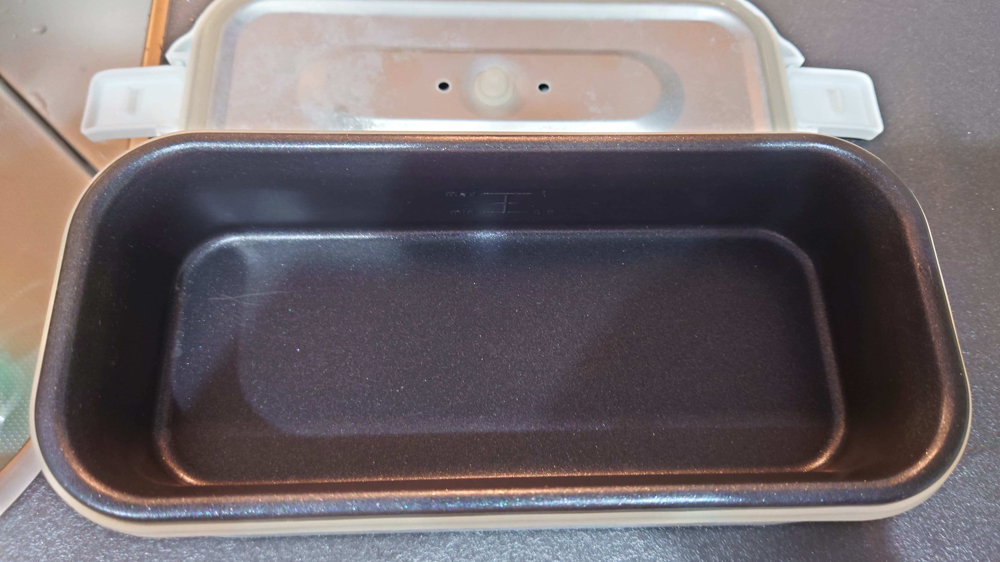
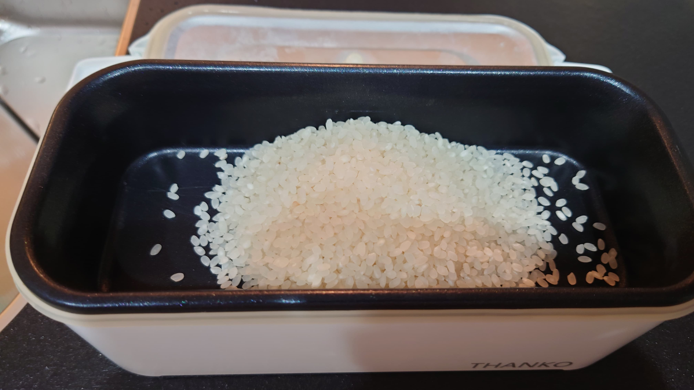
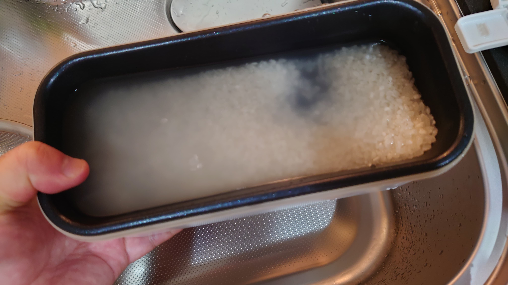
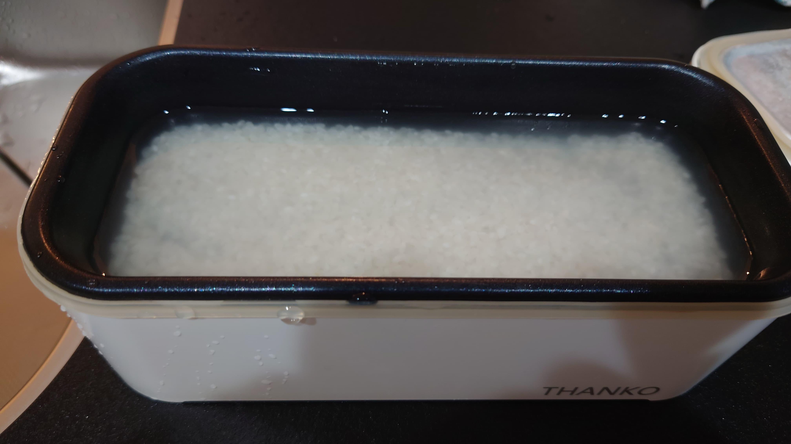
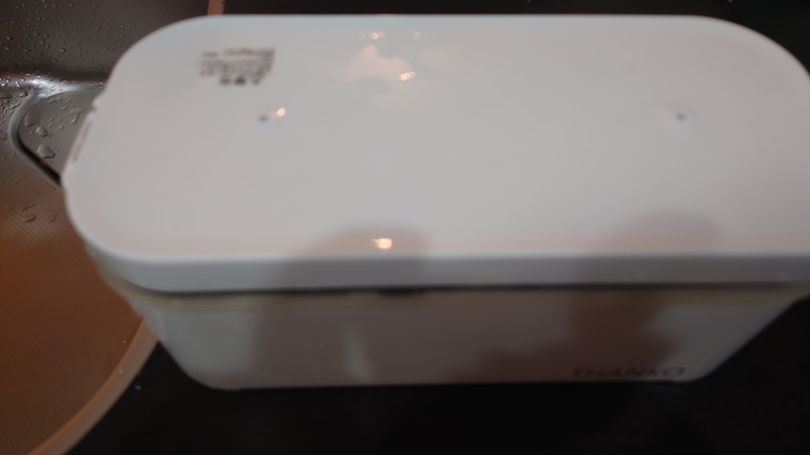
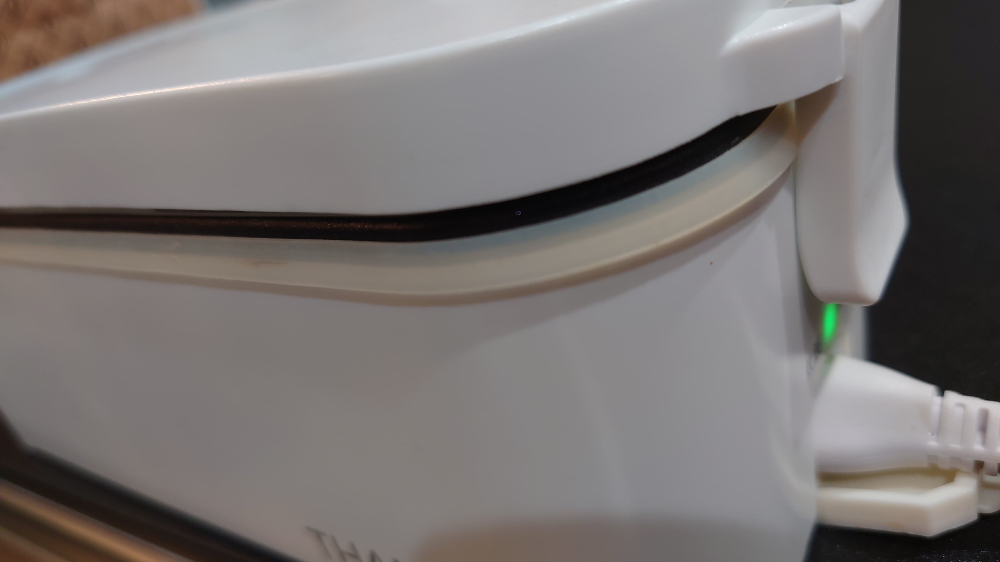
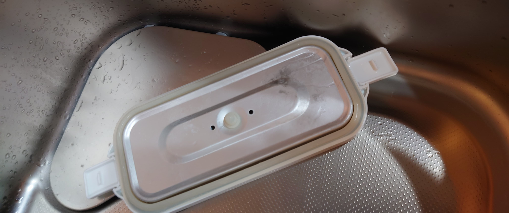
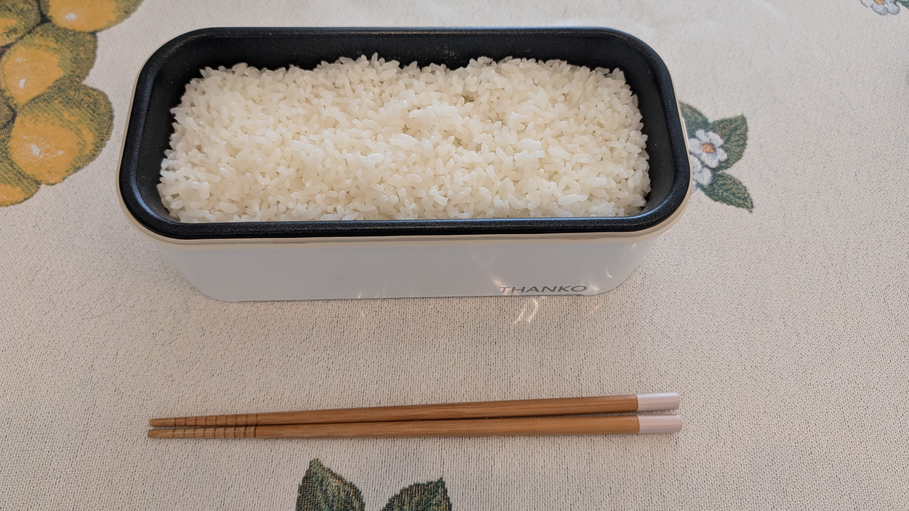

# おひとりさま用超高速弁当箱炊飯器というのがある

THANKOというメーカーから、おひとりさま用超高速弁当箱炊飯器(定価:￥6,980_)https://www.thanko.jp/view/item/000000003453というのが出ています。

「最短14分で炊きあがる、一人暮らしや単身の方におすすめな弁当箱型の一人用小型炊飯器(※HPから引用)」というのが売りなのですが、この炊飯器を導入してしばらくたつので、実感などを書いてみます。

## どういう製品なのか？

簡単に言うと、コンセントから給電して1人分のご飯最大1合を爆速で炊けるミニ炊飯器です。

## 実際の使用感

使用前のイメージはこんな感じです。下部にある本体側の上側にメモリがあるのがわかります。

なおメモリは0.5合、0.75合、1合の3つが刻まれています。

{width=60%}

実際に米を入れて炊いていきましょう。

{width=60%}

本体は防水になっているので入れた米をそのまま洗えます

{width=60%}

ラインまで水を入れます。

※なお火力が結構ギリギリみたいで、1合炊きより0.75号炊きのほうが美味しく炊けます。また1合炊きでやると容量的にもギリギリで、炊飯過程で上の通気口からすこし蒸気といっしょに炊飯中の水分が出て周りに垂れます……　垂れてもいい場所で炊こう。

{width=60%}

蓋をします。両側が引っかかるようになってパチン！と音がなります（これでしっかり上蓋が固定されます）

{width=60%}

防水フタを外して、コンセントを刺します。赤色のランプが点灯し、炊きあがると緑色になります(写真は白黒だとわかりにくいですが緑色です)。炊きあがるまでは実際15分ぐらいです。

{width=60%}

なお、炊飯器の蓋には大量の炊飯時に出た水分が貯まるようになっている(斜めにすると熱いのがこぼれる)ので、すぐ流しに置くのがベストプラクティスです。

{width=60%}

炊きあがりました

{width=60%}

なお蒸らしも何もない状態ですし、下側ほどベタっとするので、弁当箱の中でご飯をあるていど撹拌したほうが美味しく食べられます。

ではいただきます！

## おわりに

すこし荒削りな面もありますが、実際に15分程度ただし側面ランプの色しか変わらないのでそれだけだと見逃しがちで炊きたてのご飯が食べられるので非常に使い甲斐のある製品だと思います。

一人暮らしの人は導入してみても良いかも知れません。
