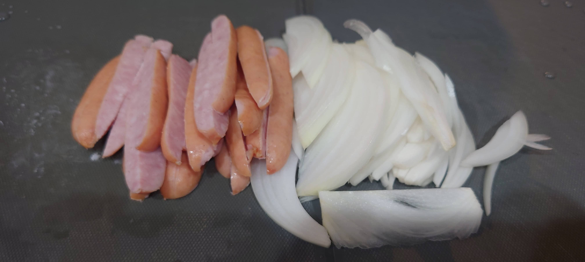
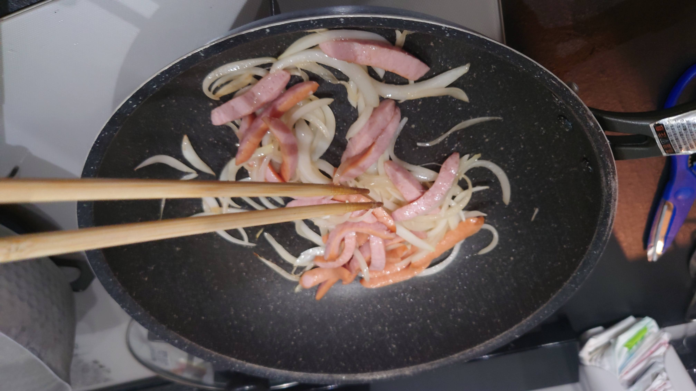
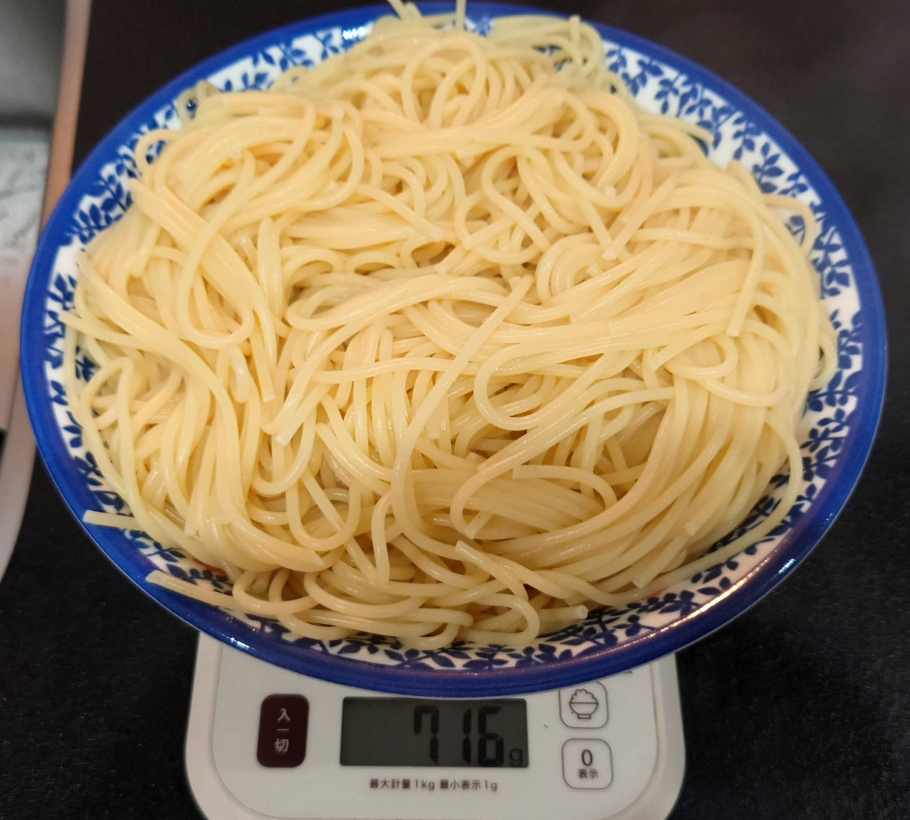
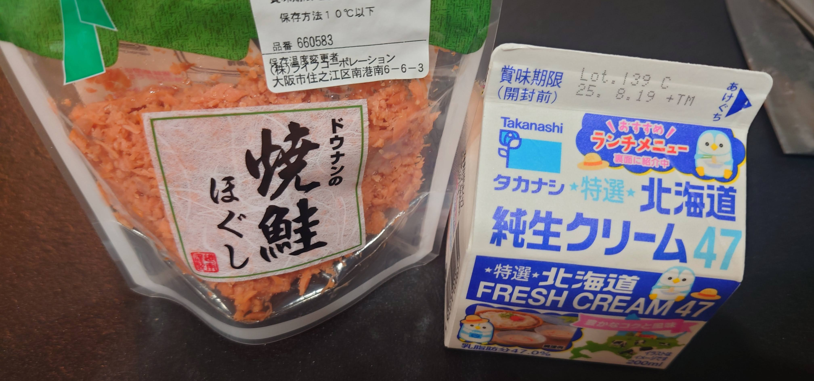
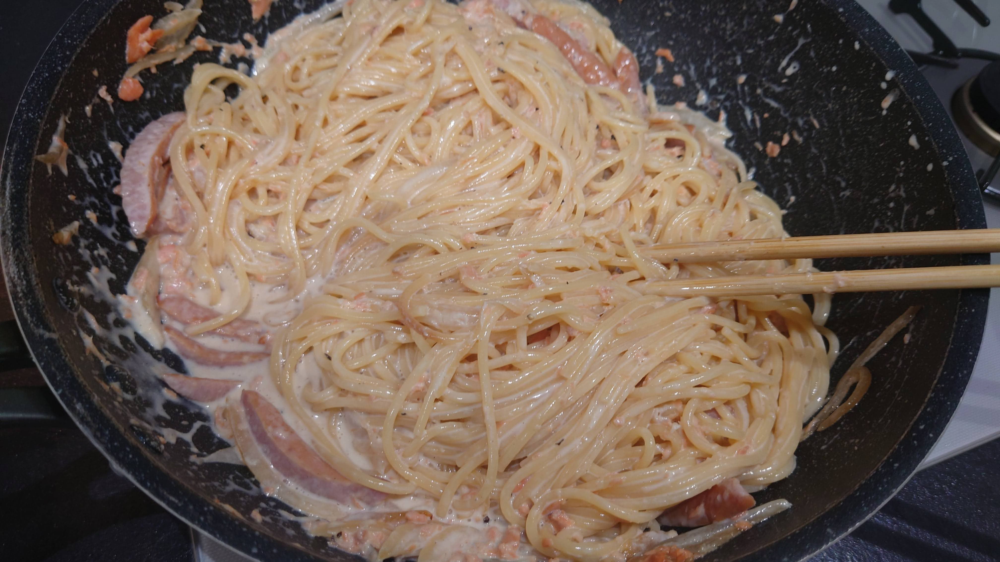
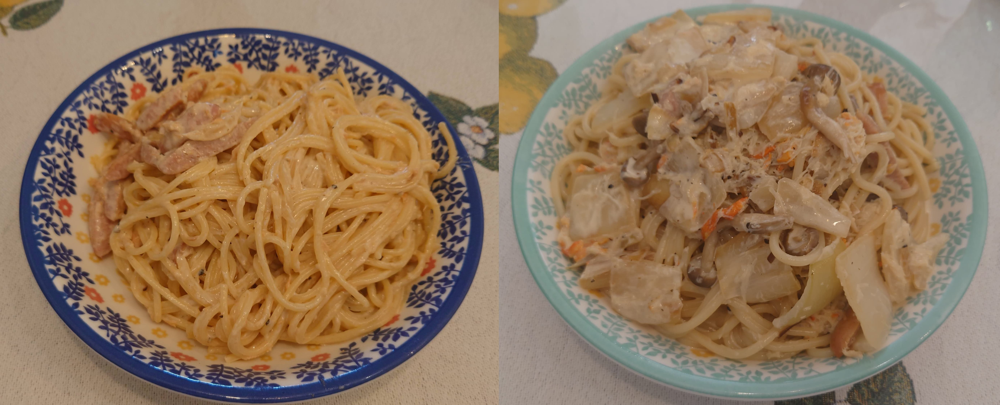

# げきうまクリームパスタをつくろう

## 前提として

まず、この料理の大前提となる**極めて重要な公式**を、まずお伝えしておきます。

　

**美味しいものは脂肪と糖でできている**日本コカ・コーラの からだすこやか茶WのCMのコピーから引用

　

つまり、「**げきうま**クリームパスタ」は「**脂肪と糖(炭水化物)のがっつり乗った**クリームパスタ」と言えそうです。ですので、次の具材を用意します。

## 用意する具材

| 材料 | 量 | 備考 |
| ---- | ---- | ---- |
| パスタ | 一人前で100g これを人数分 | 多少増減してもOK |
| 生クリーム | 一人前で100ml これを人数分 | 多少増減してもOK ※間違っても**植物性油脂を買ってはいけない** |
| 鮭フレーク | 一瓶で２人前ぐらい | 多少増減してもOK |
| 味塩コショウ | 適量 | 味の調整用 |
| コショウ | 適量 | 味の調整用。可能ならペッパーミルのが良い(香りがいいんで) |
| あじしお | 適量 | 味の調整用(塩でもよい。なくてもいいかも) |
| 牛乳 | 欲しければ | 薄める方向での調整要員＆スープパスタっぽい方向にしたい時用 |
| その他具材 | 適量 | 入れたければどうぞ ただし事前調理の必要がある |

※なお鮭フレークは、塩味＋海産物で代用できるので、たとえばカニ缶や冷凍のカニほぐし身などでも代用可能です。

※生クリームは入手性が良いタカナシ乳業https://www.takanashi-milk.co.jp/products/p_cream
のを使ってます。あれば「特選北海道純生クリーム47」がおすすめ(この料理は薄める方向には倒しやすいので)

## 手順

調理手順は次の通り。

### その他具材を切る(鮭フレーク以外の具材を入れたい場合)

具材を切っておきます。まあ添えるぐらいなので一人あたり100gも要らないかな

{width=80%}

### その他具材を炒める(鮭フレーク以外の具材を入れたい場合)

サラダ油を軽く引き、中火のフライパンで炒めます。

{width=80%}

これと並行してパスタを茹でておきます。

### パスタが茹で上がったらお湯を切る

お湯を切って、折角なので計量したら茹ですぎていました…… orz

　

※乳化を前提に、お湯がっつり切りすぎないほうが良いという人もいます。ここらへんは好き好き

{width=70%}

### パスタソースを作る

まず、生クリームと鮭フレークをフライパンの横に置いておいて、熱い鍋に投入される覚悟を決めてもらいます。

{width=70%}

その後、今まで準備した、**パスタ以外の具材**を全部一つのフライパンに投入して、火を入れながら(中火～弱火ぐらいで)撹拌していきます。

　

投入されたら、味をみながら薄ければ味塩コショウ、コショウ、あじしおなどで調味

　

※基本的には鮭フレークを使っている場合は塩味がすでにあるので調味はほぼ不要。塩味が薄い具材をベースにしている時は調味して、ちょっと濃い目にしとくのが良い(パスタからどうしてもゆっくり水分が出て薄まる為)

### 全部投入する

フライパンにパスタを入れて、中火にして撹拌しながら加熱、いい感じにまとまったら完成。

{width=100%}

※なお、スープパスタ寄りの作りにしたい場合は、この時併せて牛乳でのばしながら、味塩コショウ、コショウ、あじしおなどで調味して完成にもっていくとスープパスタになります。

### 完成

出来上がりはこんな感じです

{width=100%}

## おわりに

**生クリーム**をケチらずに使うのがコツです。

具材の準備さえケチらなければ、ちゃんとうまいパスタが確定するので、是非試してみて下さい。
