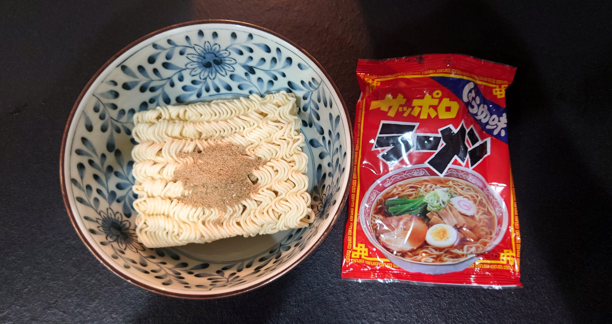
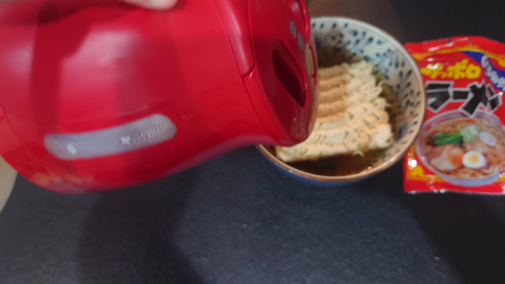
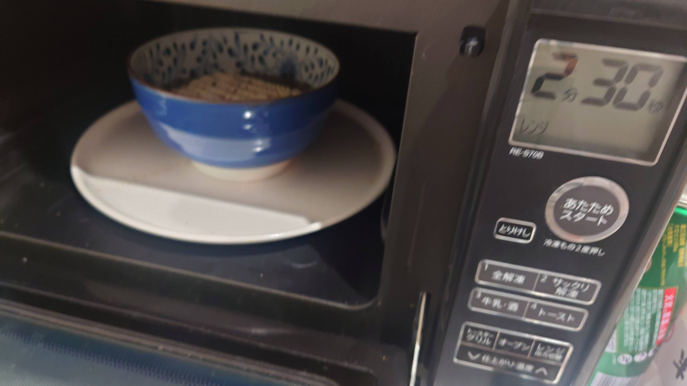
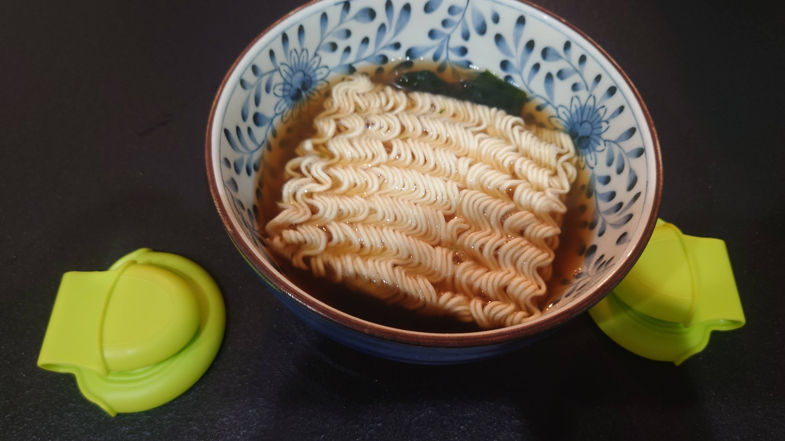
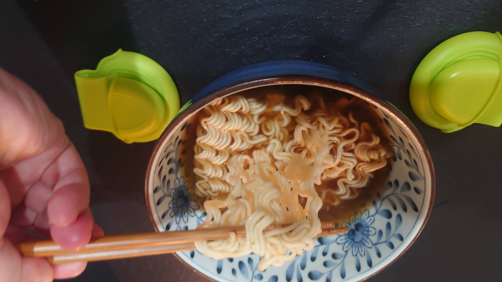

# 袋麺は鍋で煮込まなくても食べられる？

## はじめに

実は袋麺は、鍋で煮込まなくても

 * 適切なデカさの丼
 * 必要量の熱湯(もしくはそれをわかせる電気ケトル)
 * 電子レンジ

があれば作れます。

## 手順

手順は次の通り。

### お湯を沸かす

沸かしておきます。

### 丼に袋麺を入れる

丼に袋麺を入れます。この時、粉末スープは麺の上に入れておくのが良いです。

また、乾燥わかめなどの乾燥具材を入れたい場合は麺の下に入れておきます。

{width=80%}

### お湯を注ぐ

お湯を麺の上にまんべんなくかかるように注ぎます。

{width=80%}

### レンチン

袋麺の茹でる時間に従って、その時間分レンチンします。

{width=80%}

### はこぶ

レンジの中ではもう、できています。熱いのでミトンとかタオルで丼を持つようにしましょう。

なお耐熱ミトンでは、個人的にはIKEAのDOFTFUNKIAhttps://www.ikea.com/jp/ja/p/doftfunkia-pinch-holder-green-00588811/がおすすめです。使いやすい(のにえらく安い)。

{width=80%}

### たべる

たべましょう。

{width=80%}

## おわりに

袋麺、特にフライタイプの麺は、レンチンでも簡単に戻りますし、例えば非常時などは水を入れて戻す事もできるようです。

知っておくと便利な袋麺ライフハックでした。
