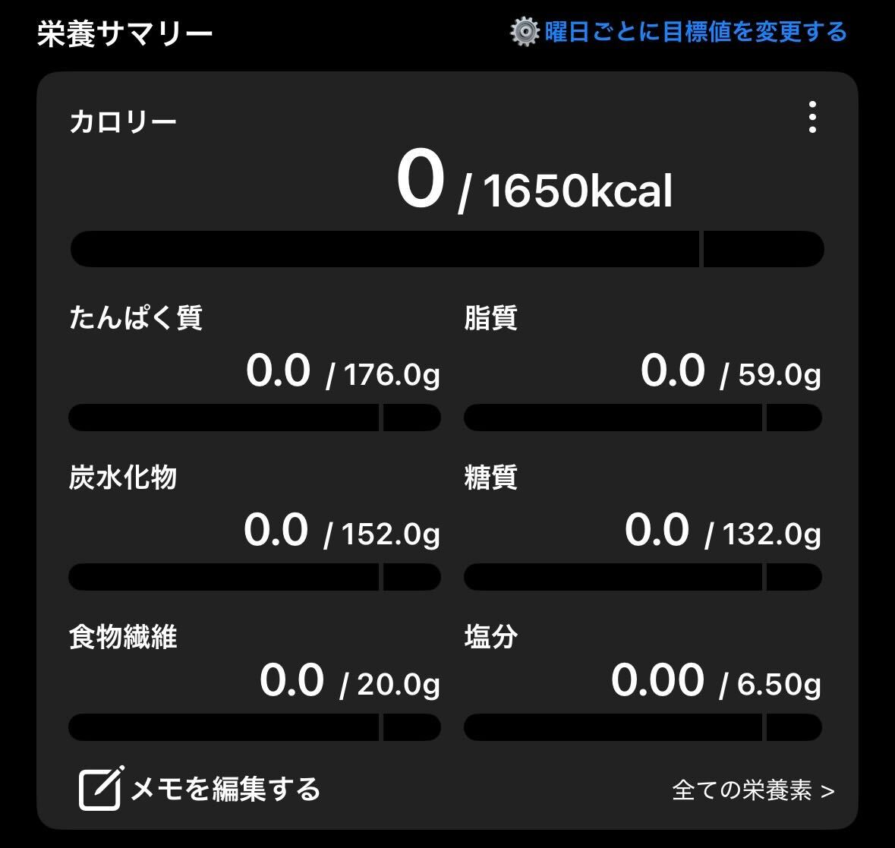

# 短期的に痩せた食事（リバウンド注意）

FORTE(フォルテ)@FORTEgp05

本章の執筆をしましたFORTE(フォルテ)と申します。

みなさんはダイエットの経験はありますか？

もし経験がないのなら、それはいいことだと思います。体質にもよりますが、努力しなくても痩せられる、健康的に痩せていられるのはいいことです。

ですが、長い人生、さまざまな理由で短期間で痩せたいという時がくるかもしれません。この章はそんなときにお役に立てれば幸いです。

ただし、長期間のダイエットや恒常的な健康的な食事としてはおすすめしません。詳細な理由は後述しますが、リバウンドの可能性が高く、また実際にリバウンドしたからです。

そのため、あくまで短期間ダイエットとして紹介する意図となります。

## 食べたものを計測する〜透明性〜
食事の紹介と言いつつ、実はある条件を満たせば何を食べても良いものになります。なので、可能なら二郎系ラーメンでも問題ありません、あくまで可能なら、ですが。

その条件とは「1日の栄養摂取量の目安を守る」ということです。

そして、そのためには1日どれくらいの栄養を摂っているか把握しなければなりません。そのための透明性です。

### 計測方法はカロミルがおすすめ
なにをどれくらい食べたか？で有名なアプリでは「あすけんの女」で有名なあすけんがありますが、ここではカロミルをオススメします。

あすけんでは課金しないと詳細な数値がわからないのですが、カロミルでは無課金でも詳細な数値が見えます。そのため、あと20g糖質が取れるからこれは食べてもセーフ、と判断がしやすいのです。

カロミルに食べ物を記録しつつ、あとどれくらい食べられるか、食べるべきか確認しながら食事を摂っていきます。

まさに透明性ですね！

### どれくらい食べるべきか？
これは厚生労働省のサイトhttps://www.mhlw.go.jp/stf/seisakunitsuite/bunya/kenkou_iryou/kenkou/eiyou/syokuji_kijyun.htmlに基準がのっていますので、これを参考にアレンジを加えるといいでしょう。

| 活動量 | エネルギー | 脂質 | 炭水化物 | たんぱく質 | 塩分 |
| ---- | -------- | ---- | -------- | -------- | ---- |
| 低い | 2,350 kcal | 52–78 g | 294–382 g | 76–118 g | 7.5 g |
| ふつう | 2,750 kcal | 61–92 g | 344–447 g | 89–138 g | 7.5 g |
| 高い | 3,150 kcal | 70–105 g | 394–512 g | 102–158 g | 7.5 g |

この表はあくまで厚労省の推定エネルギー必要量（ERR）で計算しているので、この推定よりERRが下がるのであれば当然必要なエネルギー料も下がります。

そのため、あくまで個人的な感覚ですが、1,800 kcalくらいを目安にすると良いと思います。

このあたりは自分で試してみて調整するべき数値かなと思います。

また例えばカロリーを減らせばその分早く痩せますし、脂質や糖質を下げるのも有効です。

しかし、極端に取らないのはダメです。例えば痩せたいからといって1日500キロカロリーしか取らない、というのは絶対に止めましょう。

食べなければ痩せるというのは事実なのですが、それは寝なければ1日24時間使えるというくらい無理な話です。

食べ過ぎるのも良くないですが、食べなさ過ぎるのもよくありません。それは健康によくないというのもありますが、ダイエットにも逆効果となります。

### 極端に食べないことの弊害
食べないことはなんとなく健康に悪いと思いますが、具体的な話を知らない方もいるでしょう。そのため、ここでひとつ具体例を挙げます。

それは糖尿病です。

糖尿病と聞くと食べてないのに？と思うかもしれませんが、要は体内で糖が有効に使われ（使え）ないのが問題https://www.jds.or.jp/modules/citizen/index.php?content_id=2となります。

糖分はエネルギーとして使われるのは想像できると思いますが、主に使うのは筋肉です。

そして筋肉を作るには栄養が必要です。

もう分かりましたね、極端に食べないことで筋肉が衰えた結果、糖がうまく使えない身体になってしまい、糖尿病になってしまう可能性があるのです。

また食べないのは長続きしません。極端に制限した場合は尚更です。

すると、いつしか限界が来たり、お盆、クリスマス、正月、誕生日、旅行などのイベントでは羽目を外して食べてしまいがちです。

普段の食事が少ない（いわゆる飢餓状態の）人がいわゆるドカ食いをすると、血糖値の増減によって食べ過ぎてしまうと言われています。

それによって逆に食べ過ぎてしまうということが起こります。

## 何を食べるか？〜検査〜
どれくらい食べればいいかは分かりましたが、何を食べればいいかは難しいところです。

というのも食べるものには栄養以外にも様々な変数があるからです。

- 味の好み
- 価格
- 食べやすさ
- 日持ち
- 身体への影響

またどう食べるかにもよって変わる部分でもあります。

これは毎回の食事で起こることであり、行動に対するレビューがすぐ得られます。

味や用意の面倒さもそうですが、カロミルに登録した内容から食べ過ぎ・食べなさ過ぎが分かります。

まさに「検査」ですね。

## おすすめの食材
ここでは短期的に痩せるための食事として実際に私が食べて効果があったものを紹介します。

### 低脂質ヨーグルト
ザバスの「MILK PROTEIN ヨーグルト 脂肪0」です。

こちらは、たんぱく質が15gありながら、カロリーは84kcal、脂質は0g、糖質も5.9gと非常に優れています。

なにより、美味しいです（個人の感想）

プロテインヨーグルトは様々な商品がありますが、本当においしくないものもある中、このヨーグルトは非常に食べやすいです。

### 鶏むね肉
たんぱく質といえばの王道、鶏むね肉です。

こちらは皮なしであれば100gで、たんぱく質が24.4g、カロリーは113kcal、脂質は1.9gとなっています。

皮ありだと脂質き5.9gとなります。

肉は食べたいが、カロリーや脂質、なにより値段が気になるという方は断然この鶏むね肉がおすすめです。

最安値は100g50円台も見たことがあります。

### かつお
魚も非常に優れた食材です。

同じ脂でも肉やバター、ごま油に比べて、魚やオリーブオイル、ナッツ類の脂は身体に良いと言われています。

また脂質が少ない魚を選べば、高タンパク低脂質を実現できます。

その代表なのが、かつおです。

かつおの叩きは100gで、たんぱく質が27.1g、132kcal、脂質が2.6gとなっています。

夏場はお安め（個人的には100gで200円未満なら買い）なので、スーパーで見かけたらぜひに。

シーズン外の冬場は高いので、冬にシーズンが来る魚がよいでしょう。

## 自炊しない場合のおすすめ

## 食べ方を工夫する〜適応〜
高タンパク低脂質を目指すのなら食材もそうですが、調理方法に工夫が必要です。

というのも減塩も目指すなら、いつもの感覚で料理していては塩分過多になってしまうからです。

鶏むね肉を焼くにしても塩胡椒や、醤油などで焼くとすぐに塩分が多くなってしまいます。

ここで重要なのは塩分は入っていないがしっかり味が付く香辛料と、風味が増す調味料です。

それぞれ見て適応していきましょう。

### 香辛料
香辛料といえば唐辛子などを思い浮かべる方が多いと思います。

しかし、スパイスをイメージしていただくとその種類は非常に多いと思います。

その中で今回おすすめするのは、黒胡椒です。

黒胡椒はメジャーなものですが、ぜひミル付きのホール（粒）で買っていただきたいです。

ミルというのは胡椒を挽くための道具ですが、スーパーにいけば300円前後で買えますし、ダイソーなどにも売っていると思います。

胡椒はそのピリっとした辛味が特徴ですが、香辛料の名の通り香りも大事です。

ホールからミルで挽いてふりかけると、その香りが非常に際立ちます。

和食、例えば納豆などにも合いますので、ぜひミル付きで試していただきたいです。

### 調味料
調味料でおすすめなのは料理酒、本みりん、味の素、にんにく、生姜、塩分無添加の顆粒だし、減塩醤油、味噌あたりがおすすめです。

どれもスーパーに行けば手に入ると思います。

特に料理酒と本みりんは沸騰させてアルコール分を飛ばすと酒臭さは無くなっても風味が残りますし、そこに醤油や味噌、にんにくや生姜などを加えるととてもおいしくなります。

これで鶏むね肉を煮たり焼いたりすると、本当に鶏むね肉か？というくらい美味しくなります。

味噌は塩分が多いイメージがありますが、少し入れるだけでも味が変わりますし、1日1回、大さじ1杯くらいなら全然大丈夫です。

塩分を摂り過ぎるのはよくないですが、全く取らないのも考えものですし、味噌などの発酵食品は腸に良いという話もあります。

何事もほどよく摂る分には良いものだと思います。

## 実際に痩せた例
筆者は2024年4月から7月までの3ヶ月で8kgほど痩せました。

この時は毎食カロミルをつけており、数値をオーバーしないのはもちろんのこと、足りないものがないようにしていました。

つまりたんぱく質を160gと決めたら、それを満たすようにしていたということです。

さらに塩分や脂質なども気をつけていたので、食べられるものは非常に限られます。

スーパーやコンピにで惣菜の栄養素を見ると分かりますが、1品で塩分が2gとかあるのがザラなので、3品食べたらもう6gです。

3食ではなく3品なので、自然と惣菜を買うのは難しくなります。

さらに間食するとカロリー、脂質、糖質が多い割にはたんぱく質が少なくなり、たんぱく質を担保できなくなるのが分かるため、間食も我慢するようになります。

さらに外食や飲み会に行ってもビールや日本酒よりハイボール、揚げ物や脂が多い肉より野菜や鶏肉、お刺身を食べるようしていました。

そこまでやっての3ヶ月で-8kgです。

## そしてリバウンドした例
そして、2024年8月から2025年7月のおよそ1年間でプラス10kgのリバウンドをしています。

これはひとえに痩せた時のストイックさが無くなったからです。

基本的には鶏むね肉をメインに食べてますが、間食したり、外食に行ったら羽目を外して好きなものを食べ、調理が面倒なのでスーパーやコンビニで惣菜を買うようになっていました。

なまじ一度短期間の成功体験があるため、またちょっと頑張れば痩せるというのと、ストイックに頑張るのはしんどいのでどこまで緩めても大丈夫かというのを探っているうちにここまで来てしまいました。

そのため冒頭に書いたとおり恒常的におすすめする方法とは言い難いです。

ですが、3ヶ月後に結婚式があるとか、夏に水着を着たいとかの場合にはおすすめできると思います。

## さいごに
今は「我慢できるときはするが、難しいと思ったらしない」スタイルで痩せる努力をしています。

これもカロミルで記録はつけていますが、オーバーしないように気を付けるのがメインで数値通りに食べるのは意識していません。

というのは、どうせ外食したり完食したりするとカロリーと脂質と糖質はオーバーするので、普段は少なめにしておき、オーバーした時で帳尻を合うようにしたいからです。

これを書いている時点でまだ1週間ほどなので有意な結果はありませんが、いまのところストレスなく続けられています。

そのあたりも執筆できたらと思います。
