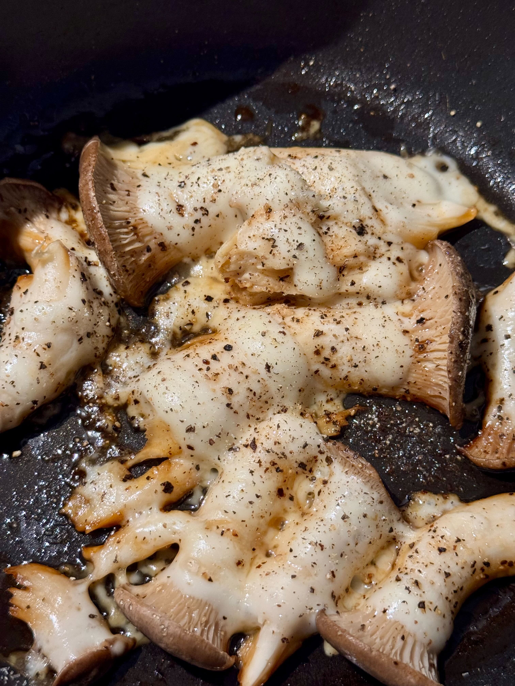

# 減塩でも香辛料と味の素で美味しく食べる

FORTE(フォルテ)@FORTEgp05

本章の執筆をしましたFORTE(フォルテ)です。

突然ですが、日本人の1日当たりの塩分接種量の目安をご存知でしょうか？

1日7.5gです。

これはどれくらいかというと、ビックマック1個で2.7g、味噌汁1杯で1.2〜1.5g、一般的な醤油ラーメンで3〜5gとなります。

特にスーパーやコンビニの惣菜は一品で1.5〜2.5gほどありますので、惣菜を2、3品買うともう目安上限に近づいてしまいます。これに味噌汁と納豆でも追加したらオーバーするでしょう。

もっと実感したかったら1日の塩分量を測ってみると、この7.5gがどれだけ難しいかわかると思います。

さらに、WHOによる世界の摂取量目安では5g未満です。7.5gでも難しいのにさらに低い数値となっています。

とはいえ、和食は伝統的に塩分が多い傾向があるので、7.5gとなっている背景もあります。なので、5gじゃないと！と世界基準に合わせる必要はありません。

このように塩分というのは接種量の目安に対して、普段の食事に含まれる量がとても多いものとなっています。

## 塩分を取りすぎるとどうなるのか？
一昔前は成人病や生活習慣病なんて言われましたが、塩分過多になると高血圧になると言われてきました。

そして同様に塩分を取りすぎると太ると言われています。

これは確たるエビデンスがあるわけではないですが、肥満の人が塩分が高い食事を好む傾向があるようです。これは肥満の人が全員塩辛い食事をしているとか、塩分を取ると必ず太るというわけではありません。あくまでそういう関連があり、また太る食事になりやすいという意味です。

考えられるシナリオとしては次のようなものがあると言われています。

- 塩辛い食べ物を食べると糖分が多い飲み物（お酒やジュース）を飲んでしまい結果として太る
- 血中の塩分濃度が上がると身体が飢餓状態になり余計に脂肪を蓄積して太る
- 高い塩分の食事は脂質や糖質が多いラーメン、ハム、スナック菓子などが含まれる

どれも明確なエビデンスがあるわけではありませんが、説としてはあり得る話ですし、どちらにせよ塩分の取りすぎは身体によくありません。

仮にこれらの説のエビデンスがないからといって毎日ラーメンを食べていたら普通に太ると思います。

たまの外食で美味しくラーメンを食べるためにも普段は減塩で食事しておくのも悪い話ではないでしょう。

## 塩分を減らす工夫
基本的には自炊することをお勧めします。

面倒だな、大変だなと思うかもしれませんが、逆に自炊しないで減塩する方が難しいです。無理と言い切ってもいいでしょう。

外食や惣菜では塩分のコントロールが難しいですし、塩分が少ない食事で簡単に買えるものはサラダかおにぎりくらいのものです。

とはいえ、出社などしていたら難しいので昼は外食、朝と夜は自炊するのを目標とすると良さそうです。

自炊で減塩を目指すにはまず栄養成分を見て塩分量を確認する癖をつけると良いでしょう。

同じお醤油でも減塩醤油を選ぶだけで塩分がカットできます。また大さじ2杯いれるところを1杯にして、代わりに別の塩分がないもので味付けするなどでも減塩できます。

具体的に見てみましょう。

## 減塩でも美味しく食べるレシピ
個人的におすすめなのが、次のような香味野菜、調味料、香辛料です。

- にんにく
- しょうが
- 料理酒（清酒）
- 本みりん
- 塩分無添加の顆粒出汁
- 黒胡椒
- 味の素
- 花椒
- 唐辛子
- いり胡麻
- バルサミコ酢

これらと減塩の醤油や味噌を使って味付けをすれば、美味しい食事が作れます。私はかなり味濃いめが好きなのですが、そんな私でも満足する味にできるので減塩でも美味しく食べるのは実現できています。

それでは簡単に作れるレシピをいくつか紹介しましょう。

### エリンギのチーズ焼き
エリンギを焼いただけの簡単なメニューです。短時間でパッと作れるのでもう一品というときや、ヘルシーなおつまみとしてどうぞ。

1. エリンギを手で縦に割いてフライパンや鍋に並べます
2. 弱火にかけて焼きながら、さけるチーズ1本を適当に裂いて乗せていきます
3. 乗せ終わったら蓋をしてチーズが溶けるまで確認しつつ待ちます
4. チーズが溶けたらお好みの調味料で味付けし出来上がり

さけるチーズはいくつか味があると思いますが、お好みの味で大丈夫です。雪印のさけるチーズ バター醤油味でも1本あたり0.49gですので非常に少ない塩分で1品できますし、味も濃くできます。

その味付けに使う調味料は黒胡椒、味の素、唐辛子などがお勧めです。また少量の醤油を鍋肌にかけて風味をつけるとさらに美味しくなります。

### もやしラーメン
ラーメンなんて！と思うかもしれませんが、きちんと調整すればラーメンの味を楽しみつつ減塩することも可能です。

用意するのは市販のラーメンスープともやし2袋、調味料だけです。

ラーメンスープはスーパーでチルドの中華麺が売っている売り場にいくと、小分けになった一食分のラーメンスープが売られています。カップラーメンの液体スープをイメージするとわかりやすいと思います。

今回は菊水というメーカーの北海道ラーメンスープ　旭川醤油味1人前を使用しました。栄養成分表示をみると塩分が5.9g！となっていますが、あくまでこれは全て接種した場合です。スープを最低限にして10%や20%にすれば塩分も0.59〜1.18gとなります。

決して少ないわけではないですが、普通にラーメンを食べると考えるずいぶんと減塩にできていると思います。お味噌汁1杯弱といったところですね。

1. お手持ちの鍋で1/2から2/3の量で水、あれば料理酒や本みりん、にんにく、しょうがを入れて沸騰させます
2. 沸騰したらもやしを入れます、もし溢れそうなら1袋ずつ入れましょう
3. もやしが十分に柔らかくなったら、ラーメンスープをいれて3分ほど茹でれば完成です

もし可能なら減塩のためにスープを全て捨て、もやしだけ盛り付けることをおすすめします。味見すればわかりますが、スープを入れて煮たことでしっかり味がついています。

飲まないつもりでスープも盛りつけてしまうとつい飲みたくなってしまうので、ここは心を鬼にして全部捨てるか、少しだけと思うならおたま一杯などにしておくと良いと思います。

## 楽しく減塩する
減塩に限った話ではないですが、常に完璧に制限するのは難しいものです。担々麺を食べに行こうぜ！と誘われても、マックいこうぜ！と言われても断るのは心苦しいです。

かといって、完璧にできないなら好きに食べよう！というのも極端ではないでしょうか？

今日は余裕がありそうだからサラダとおにぎりで済ませよう、なるべく塩分を少なくしようと頑張れる日もあれば、今日は疲れたから無理！余裕ない！たまにはラーメンをがっつり汁完食したい！という日もあるはずです。

また、汗をかいたりするので0gまで制限するのはやりすぎです。

減塩もできる日はやる、できない日はやらないくらいの感じで良いのではないでしょうか。

もちろん、主治医から指導などを受けている場合はそちらを優先してください。あくまでも特に指導を受けていない人が健康的に気をつける範囲の話で、となります。
