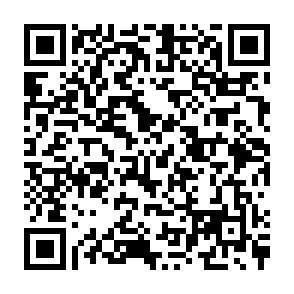
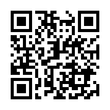
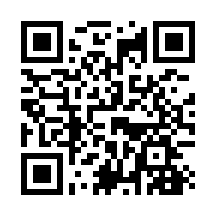

# おすすめの食コンテンツ

FORTE(フォルテ)@FORTEgp05

実はPodcastにも食に関するコンテンツがあります。音声コンテンツで食事？と思われるかもしれませんが、数十本のPodcastを聴いてきた著者のベスト3にはいるほどオススメのPodcastとなっています。

## Podcast 上出遼平 NY御馳走帖
このPodcastはニューヨークに移住したパーソナリティの上出さんが、現地の美味しいものを食べるというだけのPodcastです。本当にそれだけで、自宅から目的のお店まで移動して、目的の料理を注文し、食べ、感想を述べて終了という流れが基本です。

では、このPodcastの何が魅力なのか？というと一人の人間のリアルな食事風景と日本人には（メニューによってはニューヨーカーにも）馴染みがない料理たちです。

映像がない音声でも家を出てこれからお店に向かうというのがわかる息遣いと雰囲気、ニューヨークという異国がわかる雰囲気は本当に聞いていてワクワクします。

エピソードで登場する料理も魯肉飯（ルーローハン）やカレーラーメン、寿司、フォーなど国際色豊かなメニューが並びます。また日本人ということあり、たまに日本に帰国して食べる日本料理の回もあったりします。最後に登場するボバンペについて必聴のエピソードです。

すでに配信が止まってしまっているのがとても残念なPodcastですが、配信されている分でもぜひ聴いてみてください！

## お料理系Youtube
料理研究家やレシピ紹介など様々な料理系動画がありますが、今回はASMR要素もある料理系Youtubeチャンネルを紹介します。

ひとつは「リロ氏のひとり遊びちゃんねる」です。こちらは毎日2分程度の料理動画をアップされているのですが、それがどれも美味しそうなのです。基本的にはお酒に合うつまみを作って飲むという感じなのですが、そのつまみの作り方が思っても本当にやるか？というような内容でとても美味しそうです（褒め言葉）

揚げたり焼いたりするときの音や炭酸飲料を注ぐときの音がASMR的に入っています。食材や調理器具、料理方法が参考になることも多いので、ぜひ見てみてください。

もうひとつ紹介するのは「Chocolate Cacao」です。チャンネル登録者数465万人（2025年10月現在）の大手チャンネルさんで、Youtubeのイベントにも招待されるようなチャンネルです。

このチャンネルは主にチョコレートを使ったお菓子を調理する番組で、チョコレートを刻む音などがとても心地よい動画となっています。また調理されるチョコーレート菓子もとても美味しそうで、映像の綺麗さと相まってずっと流していたくなるような雰囲気です。

## 料理がメインのマンガ
最後に料理がメインのマンガとして「新米姉妹のふたりごはん」をお勧めします。この作品は両親の再婚によって高校生になってから姉妹となったふたりの関係性が料理によってどう変わっていくか？というストーリーになっています。

作品中で描かれる料理は家庭的なものから豪華もの、ジビエまで様々ですが、とても美味しそうです！またレシピも掲載してくれているので、再現メシもできてしまうのが魅力的です。

なさそうでありそうな日常も見ていて共感できるので、ぜひ読んでみて欲しいです。

