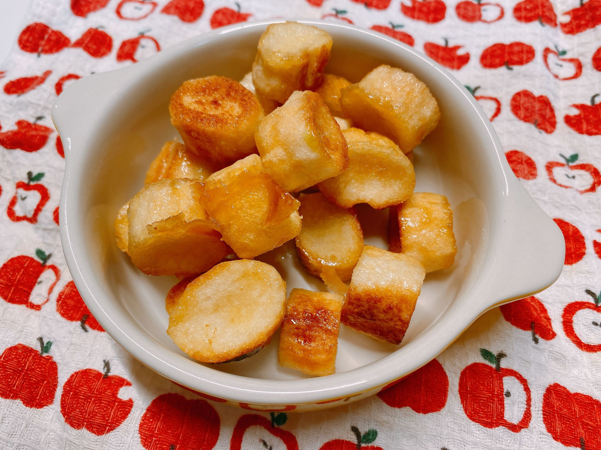

# 材料3つ、5分で爆速デプロイ！　「お麩 de ラスク」

おやつにぴったりの、サクサクしてあま〜いラスク。実は、あるものを使えば、お家でカンタンに作れちゃうんです！
それはなんと……お麩（ふ）！ お味噌汁に入れる、あのお麩を使います。
しかも材料3つ、調理時間5分という超軽量設計！
一般的なパンラスクというレガシーシステムから脱し、お麩という軽量モジュールを採用することで、あなたの開発コストを劇的に削減します。

## 材料　★3つだけ★

- 麩　　　　　20個
- 無塩バター　40g
- 砂糖　　　　大さじ1.5

## 作り方　　★5分で完成★

1. 【たれを作る】耐熱皿に無塩バターと砂糖を入れ、電子レンジでバターが液体になるまで加熱します（30秒〜50秒）。
2. 【混ぜる】バターと砂糖をスプーンでよく混ぜて溶かします。
3. 【からめる】麩を加えて、まんべんなくからめます。
4. 【焼く】トースターにアルミホイルを敷いて、3〜4分焼きます。焦げやすいので、継続的な監視を忘れずに。

きつね色になったらトースターから取り出し、お皿にデプロイ！
少し冷まして、カリッとしたら出来上がり！

## 特筆すべきフィーチャー（特徴）

### パンラスクより優しい食感！ フルレンジ・アクセシビリティ

パンでつくるラスクと比べ、このお麩モジュールはさっくり柔らかな**超軽量仕様**を実現！

その結果、ユーザー層が大幅に拡大！ 小さなお子様からご高齢の祖父母様まで、幅広い世代に対応しています。

### 圧倒的なスケーラビリティ（拡張性）

このままでも美味しくいただけますが、ちょっとした工夫でバリエーションが無限に広がります。

- 甘い系プラグイン： 焼き上がりに、きなこ、ココアパウダー、抹茶パウダーなどをまぶして風味を変えてみましょう。
- しょっぱい系プラグイン： バターと砂糖の代わりに、「オリーブオイル + 塩 + 青のり」の組み合わせもおすすめです。
- 見た目も華やかに： 星や花の形の麩を使えば、とっても可愛らしく、パーティーにもぴったり。

### 五感を刺激するユーザー体験

「焼いているときの香ばしい香り」が嗅覚を、「サクサク、カリッとした食感」が聴覚や触覚を、そして「甘さ」が味覚を刺激します。これは、まさに「五感」をフル活用したユーザー体験！

我が家では作ると一瞬でなくなる！ これは需要が供給を上回る超人気プロダクトの証！

さあ、いますぐ麩を調達し、この超高速おやつ生成システムをあなたのキッチンにデプロイしましょう！