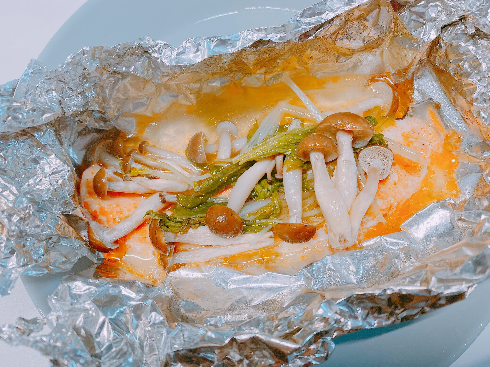

# バター＆柚子胡椒のハーモニー！ 絶品ホイル蒸し

あなたの冷蔵庫の奥で、塩漬けになっていませんか？「チューブの柚子胡椒」というデッドストックが！
この「柚子胡椒ホイル蒸し」は、【冷蔵庫のデッドストック活用】と【手間ゼロのクリーンアーキテクチャ】を実現した、最強のモダン・クッキング・ソリューションです。
柚子胡椒とバターをマージさせることで、和と洋の異なるブランチを見事に統合。創作フレンチのような奥深い風味を提供します。

## 材料　

- 生鮭の切り身……2切
- バター……10g
- 柚子胡椒……小さじ1
- しめじ、春菊……好きなだけ
- サラダ油……少々
- しょうゆ……少々

## 作り方　　★5分で完成★

1. アルミホイルを2枚用意します。しめじ、春菊を手で食べやすい大きさにちぎり、のせます。アルミホイルの長さは長めに、30cmぐらいにしたほうが、あとで包みやすいです。
2. 野菜の上に、鮭を1切ずつ置きます。鮭の上に、柚子胡椒を塗り、バター5gを上に乗せます。
3. アルミホイルを包みます。盛り付けた真上で、奥と手前のアルミホイルを隙間ができないように合わせ、開きにくいよう2度折り込みます。左右の具材がはいっていない部分をねじって、キャンディのようにまとめます。
4. フライパンに深さ2cmほど水を入れます。包んだホイルをフライパンに移して、蓋をして加熱していきます。蓋をしたまま、はじめに【中火で4分】続けて、【弱火で7～8分】加熱します。

ホイルのままお皿にのせて、できあがり！
食べる直前にしょうゆを少々かけて、召し上がれ。
（しょうゆは加熱すると香りがとんでしまうので、直前にかけるのがベスト）

## 特筆すべきフィーチャー（特徴）

### 後片付けがラク！

最大のメリットはクリーン・アーキテクチャにあります。ホイルが全てのリソースをカプセル化しているため、フライパンがまったく汚れない！　包丁やまな板もほぼ使わないから、洗い物というメンテナンス・コストが劇的に削減されます。

### 「特別感」が標準装備！ 記念日や誕生日にも

「ホイル蒸し」というだけで、ちょっと手がこんでるように見えるのも嬉しいポイント。ホイルを開ける時のワクワク感、そして開けるとただよう柚子胡椒のいい香り。家族や友人に「おっ！」と思ってもらえるかも。
お酒との相性も抜群！　白ワインやシャンパンを添えて、たまにはゆっくりディナーもいいですね。

### もっと手軽に！　クッキングペーパー & 電子レンジ
火を使う気力がないとき、小さなお子様がいて手が離せないときの代替プランもご用意！
アルミホイルのかわりに、クッキングペーパーを使うこともできます。
クッキングペーパーに包んだら、電子レンジ（500W）で6〜7分加熱してできあがり。

さあ、あなたの冷蔵庫の柚子胡椒を有効活用し、この絶品ソリューションをいますぐ導入しましょう！

