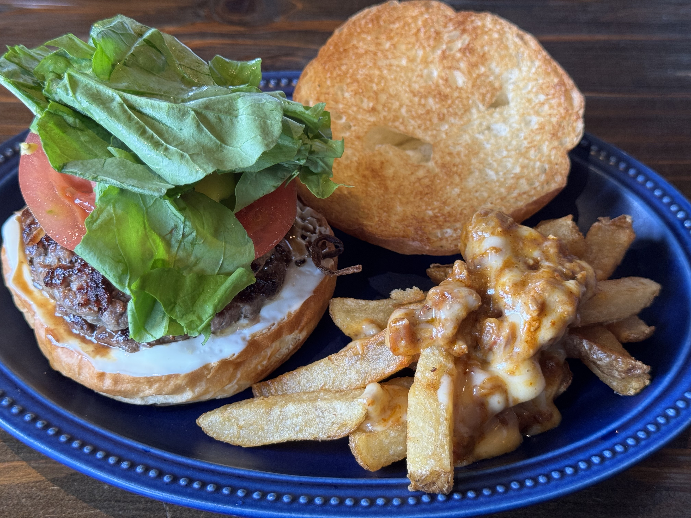
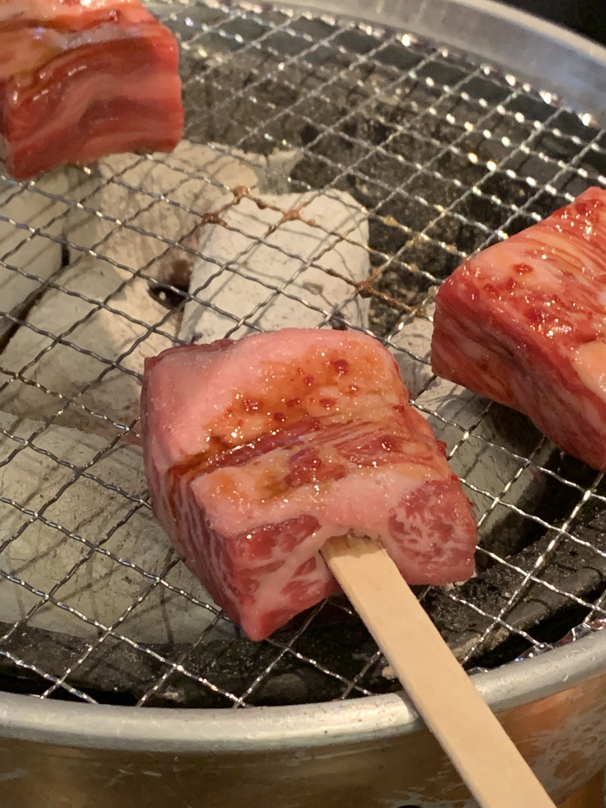
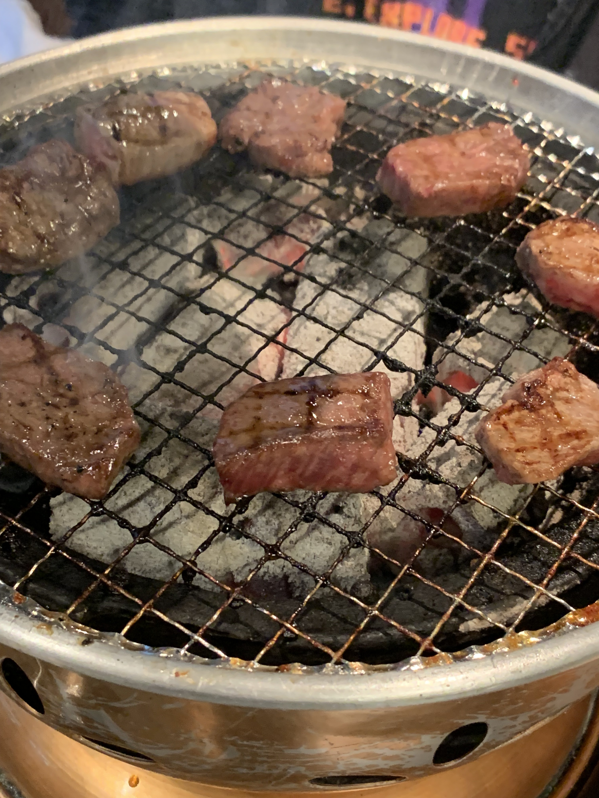
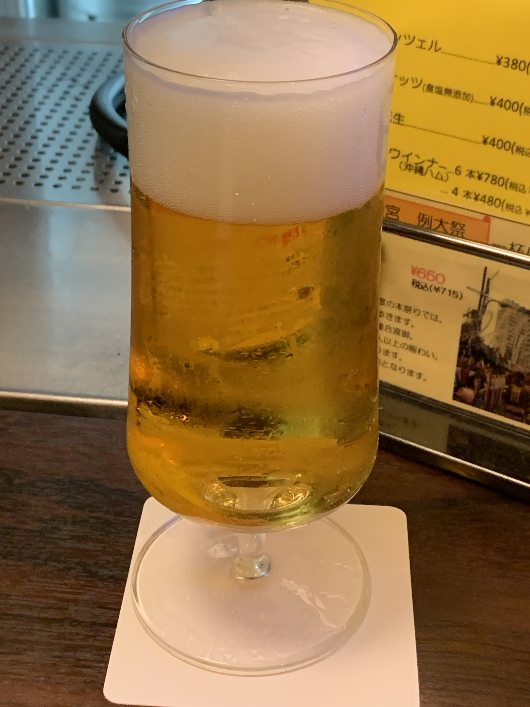
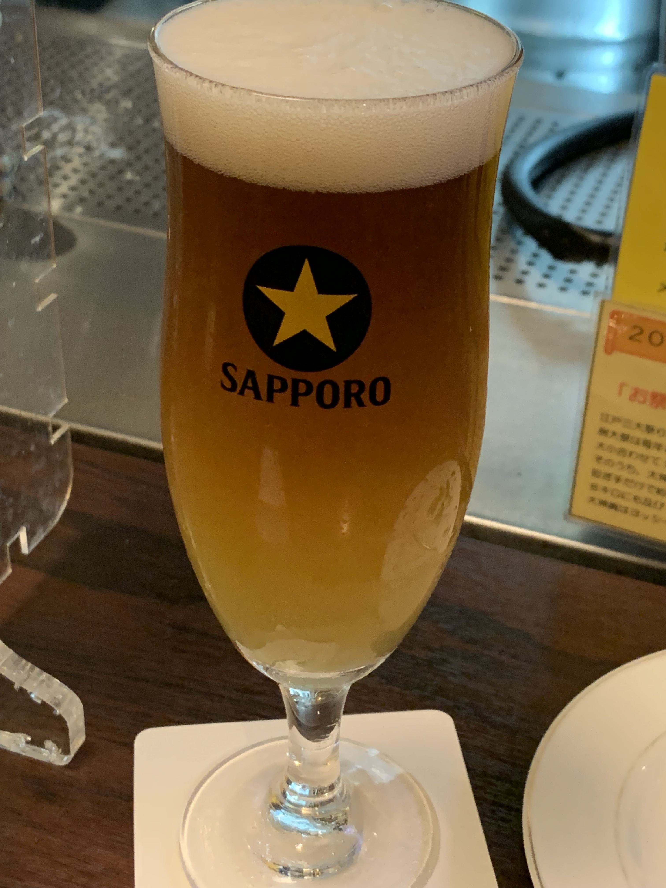

# おすすめのお店
「食」に関わるおすすめのお店を紹介します。飲食店のほか、調理器具や食材についても紹介できたら紹介します。

- FORTE@fortegp05のおすすめ
  - 潮見スキッパーズ（ハンバーガーとビール）
  - とんつう（焼肉）
  - ヨッシーズ（ビール）

## 潮見スキッパーズ（ハンバーガーとビール）
潮見スキッパーズは京葉線潮見駅にあるとても美味しいハンバーガーのお店です。おすすめポイントを3つあげるとしたら次の通りです。

 * 肉汁あふれるハンバーガー
 * 美味しすぎるサイドメニュー
 * ガージェリービールの衝撃

ハンバーガーのパティは整形されたひき肉ではなく、ステーキのようなこだわりのお肉をお店でパティにしているので肉汁がすごいです。文字通りあふれる肉汁で口や手が大変になる程なのですが、だからこそ美味しいです！そして、付け合わせのポテトや単品のハラミなどがまた美味しく、お酒のつまみにも食事としても一級品です。

そして、ガージェリービールが最高に美味しいのです！このビールは飲食店だけで飲める国産ビールで、リュトンと呼ばれるオリジナルグラスで提供されます。このグラスは自立しないようになっており、同じくガラス製の台座に刺して提供されます。味も見た目も必見のビールです！

## とんつう（焼肉）
総武線は錦糸町にある焼肉、とんつう。とある界隈では聖地とされている焼肉屋さんですが、ここは本当にお肉が美味しいです！

お肉のただのカルビとかハラミではなく、店主の方のこだわりで様々な部位（名前も特殊）が味わえます。そのこだわりは仕入れで身体を壊すくらいのもの。ぜひお店に行って、そのこだわりが書かれたメニュー裏をご覧ください。

焼肉以外にもローストビーフやごはんものも充実しており、豪勢な食事として楽しむこともできます。もちろんお酒を飲むのも最高です！

## ヨッシーズ（ビール）
日比谷線は茅場町にある「東京で2番目に美味しいビールが飲める店」ことヨッシーズ。ここで飲めるビールはサッポロ黒ラベルなどよく見るビールなのですが、本当に美味しい生ビールが飲めます！

常に3〜4種類の生ビールが飲めるのと、ビアカクテルも楽しめます。特におすすめなカクテルはお店の名前を冠したヨッシーズビア。ハーフ&ハーフのビールにグレープフルーツジュースのカクテルで非常に飲みやすいのにしっかり味わいがある。生ビールもそうですが、ビールは好みじゃないという人にこそ飲んで欲しい一杯です。北海道で飲む黒ラベルよりも美味しいなんて話もありました。

他にもパインソラチなど提供しているビールによっても変わります。さらにビールにあうおつまみとして鳥の唐揚げや季節の一品ありますので、一度足を運んでみてはいかがでしょうか？

