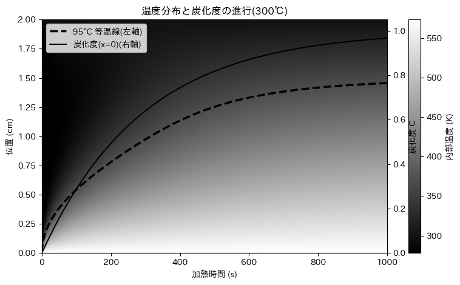

# 強火で焼かずにレシピ通りに弱火で焼け！～加熱調理モデルによる焦げと熱伝導について～

<div style="text-align: right;">ロジウム@_rhodium</div>

## はじめに
皆さんは料理をするときに、少しでも早く終わらせたくて強火にすることはありますか？私はそれでよく焦がします。
そして、外は黒こげ、中は生焼けという悲惨な結果に終わることが多いです。

この章では、なぜ強火で焼くと焦げやすいのか、そしてなぜレシピ通りに弱火で焼くことが重要なのかを、加熱調理モデルを用いて説明します。

## 加熱調理モデルとは
加熱調理モデルは、食材がどのように熱を受け取り、伝導し、最終的に調理されるかを数学的に表現したものです。このモデルを使うことで、調理過程での温度変化や焦げの発生を予測することができます。

### 肉の加熱モデル
肉を無限に広がる一様な平面と仮定します。この抽象化されたモデルにより、肉の横の断面について考慮する必要を無くします。肉の厚さを$(L)$、肉の初期温度を$(T_0)$、調理器具の温度を$(T_c)$、室温を$(T_a)$とします。

#### 熱伝導
このような無限平面の肉の熱伝導方程式は以下のように表されます：
$$\frac{\partial T}{\partial t} = \alpha \nabla^2 T$$
ここで、$(T)$は温度、$(t)$は時間、$(\alpha)$は熱拡散率、$(\nabla^2)$はラプラス演算子です。

対称性から、熱勾配は$x$方向にのみ存在し、$y$および$z$方向には存在しないと仮定できます。したがって、熱伝導方程式は以下のように簡略化されます：
$$\frac{\partial T}{\partial t} = \alpha \frac{\partial^2 T}{\partial x^2}$$

#### 境界条件
本書では、肉のフライパンに接触する面は調理器具の温度$(T_c)$に保たれ、肉の他の面は室温$(T_a)$に保たれ、これらは無限の熱容量を持つと仮定します。したがって、境界条件は以下のようになります：
$$T(0, t) = T(L, t) = T_c$$
$$T(x, 0) = T_0$$
$$\frac{\partial T}{\partial x}(0, t) = \frac{\partial T}{\partial x}(L, t) = 0$$

### 焦げの発生
焦げは、食材の表面温度が特定の閾値を超えたときに発生します。例えば、肉の場合、表面温度が約150℃を超えると焦げが発生し始めます。
また褐変反応（メイラード反応）は、食品の表面温度が約140℃を超えると急速に進行します。

#### Arrheniusの法則
焦げの発生はArrheniusの法則に従います。これは、化学反応速度が温度に依存することを示しています。具体的には、焦げの発生率$(k)$は以下のように表されます：
$$ k = A e^{-\frac{E_a}{RT}} $$
ここで、$(A)$は前駆体因子、$(E_a)$は活性化エネルギー、$(R)$は気体定数、$(T)$は絶対温度です。

この$k$を用いて、焦げの進行度$(C)$を以下のように表すことができます：
$$ \frac{dC}{dt} = k(1 - C) $$
ここで、$(C)$は焦げの進行度を表し、$(C=0)$は焦げていない状態、$(C=1)$は完全に焦げた状態を示します。

## 微分方程式の解
これらの微分方程式を数値的に解くことで、時間とともに肉の温度分布と焦げの進行度を予測できます。例えば、強火で調理した場合と弱火で調理した場合の温度分布と焦げの進行度を比較することができます。

### 伝熱
ここでは、殺菌のため中心部の温度を90度以上に2分保つことを目標とします。

伝熱方程式から、この条件を満たすために必要な時間を計算できます。例えば、肉の厚さが2.5cm、初期温度が5℃、調理器具の温度が200℃の場合、以下のようになります。

```python
import numpy as np
import matplotlib.pyplot as plt
from scipy.integrate import solve_ivp

# 定数
L = 0.025
T0 = 5 + 273.15
Tc = 200 + 273.15   # x=0 側：器具に密着・温度固定（ディリクレ）
Ta = 25 + 273.15    # x=L 側：空気側も簡略に温度固定（ディリクレ）
alpha = 1.4e-7

# 空間離散
N = 100                      # 全格子数（端点含む）
x = np.linspace(0, L, N)
dx = x[1] - x[0]

# 状態は内部点のみ（端点0とN-1は既知の境界）
idx = np.arange(1, N-1)

# 初期条件（内部点）
T_init = np.full(N-2, T0)

# 右辺（内部点の温度のみが状態）
def rhs(t, T):
    # T は内部点の温度ベクトル
    Tfull = np.empty(N)
    Tfull[0] = Tc         # 左端（既知）
    Tfull[-1] = Ta        # 右端（既知）
    Tfull[1:-1] = T       # 内部

    dTdt = np.empty_like(T)
    # 2階差分（内部点 i=1..N-2）
    for k, i in enumerate(idx):
        dTdt[k] = alpha * (Tfull[i+1] - 2*Tfull[i] + Tfull[i-1]) / dx**2
    return dTdt

t_eval = np.linspace(0, 600, 100)
sol = solve_ivp(rhs, (0, 600), T_init, t_eval=t_eval, method="BDF")

# 可視化のため端点を復元
T_map = np.empty((N, len(t_eval)))
T_map[0, :] = Tc
T_map[-1, :] = Ta
T_map[1:-1, :] = sol.y

plt.imshow(T_map, extent=[0, 600, 0, L*100], aspect='auto', origin='lower', cmap='hot')
plt.colorbar(label='Temperature (K)')
plt.xlabel('Time (s)')
plt.ylabel('Position (cm)')
plt.title('Temperature Distribution in Meat (Dirichlet-Dirichlet)')
plt.show()

```

### 焦げの進行
次に、焦げの進行を計算します。ここでは、焦げの進行度$(C)$を計算します。

```python
# ---- パラメータ ----
A  = 1e3        # 前因子
Ea = 6e4        # 活性化エネルギー (J/mol)
R  = 8.314      # 気体定数

t_span = (0, 600)                 # 0～600 s
t_eval = np.linspace(*t_span, 400)
C0 = [0.0]                        # 初期進行度（未焦げ）

# 速度定数（アレニウス）
def k_T(T):
    return A * np.exp(-Ea / (R * T))

# 接触面のみの ODE: dC/dt = k(Tc)*(1 - C)
def dCdt(t, C):
    k = k_T(Tc)
    return [k * (1.0 - C[0])]

sol = solve_ivp(dCdt, t_span, C0, t_eval=t_eval, method="BDF")

# ---- 可視化（横軸=時間）----
plt.plot(sol.t, sol.y[0])
plt.xlabel('Time (s)')
plt.ylabel('Char progression at contact surface, C')
plt.title('Char progression (contact surface only)')
plt.ylim(0, 1.05)
plt.grid(True)
plt.show()
```

ここで200℃と300℃での焦げの進行度を比較します。

{width=80%}

{width=80%}


結果、300℃では中心部分が95℃に達した時点で7割がたが焦げてしまっています。一方、200℃では中心部分が95℃に達した時点で焦げはほとんど進行していません。

## 結論
強火で焼くと、食材の表面温度が急激に上昇し、焦げが発生しやすくなります。一方、弱火でじっくりと加熱することで、食材全体が均一に加熱され、焦げを防ぎつつ内部までしっかりと調理することができます。

したがって、レシピ通りに弱火で調理することが、美味しい料理を作るための鍵となります。